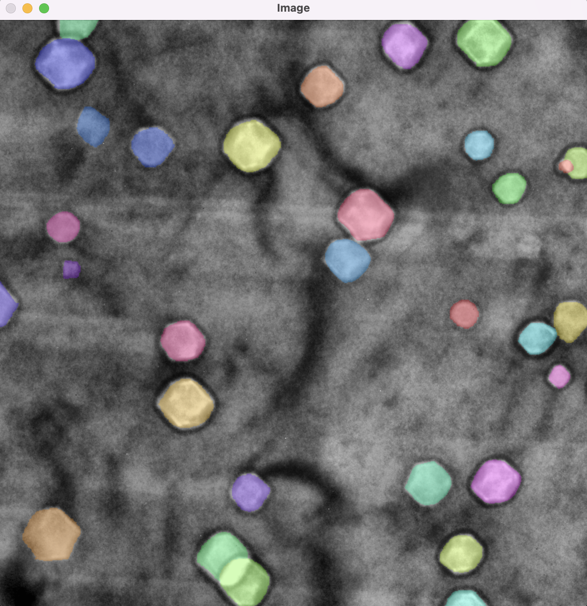
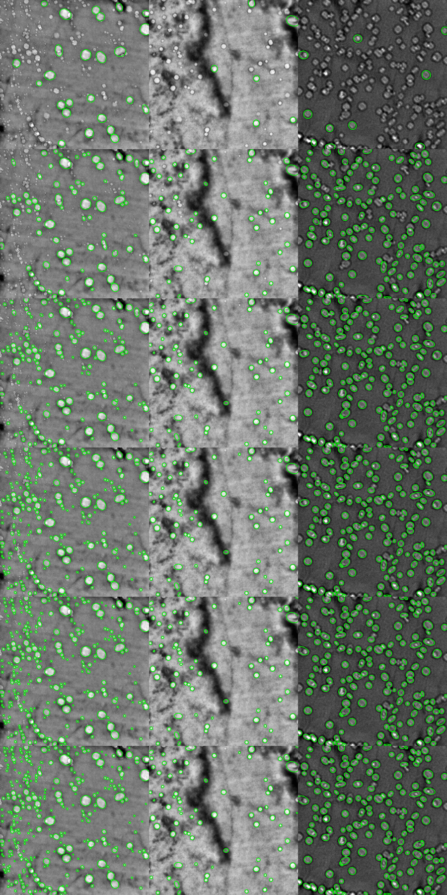

# A deep learning model for automatic analysis of cavities in irradiated materials


## Overview
This framework utilize the Mask R-CNN to train a model, and OpenCV to extract the statistical information from object masks. We have explored this decent framework with cavities dataset. It also provides the post-processing component to help you remove unwanted objects. We will explain each modeule with cavities dataset in detail below.


# Requirement

- We use python 3.6
- There's a `requirement.txt` that includes all the packages needed to run our codes
```
UNIX> pip install -r requirements.txt 
```
- Install Mask-RCNN
```
UNIX> python setup.py install
```


## Cavities detection

### Step 1 - Obtain the dataset

Generally, the object masks are represented using a set of boolean matrix. However, this storing method can take extremely large disk space when image is large and has many objects. Thus, this mask is stored as a list of position in the image in our cavities dataset. 


We use the `LabelBox` to annotate all the masks. Below is how you can download our dataset. The progorams takes two arguments. 
- `starting_id` - An integer number specifying at which image to start to download. 
- `num_images` - An integer number specifying the number of images to download. 

Note: We have 685 images in the labelbox, of which 228 are annotated and the rest are discared. So our total dataset size is 228. Unfortunately, downloading the images could take a while.
```
UNIX> python QC_bubble/image_data_export.py
usage: python QC_bubble/image_data_export.py starting_image num_images
UNIX> python QC_bubble/image_data_export.py 0 100000
The number of images 685
Generate image 1
Generate image 2
Generate image 3
Generate image 4
...
```


If you have multiple processors, doing below could speed up downloading. Below uses 7 processors.
```
UNIX> for i in `seq 0 6`; do python QC_bubble/image_data_export.py "$((i*100))" 100 &  done
```
### Auxiliary - View the image and masks

We have `QC_bubble/read_mask.py` to help you view masks. It takes the image file followed by a annotation file you obtained from step 1.

```
UNIX> python QC_bubble/read_mask.py
usage: python QC_bubble/read_mask.py img_name mask_name
UNIX> python QC_bubble/read_mask.py bubble_dataset/images/00009.png bubble_dataset/annots/00009.npy 

```



### Step 2 - Train the model

We have `QC_bubble/bubble.py` to train a model. It takes two arguments

`dataset_dir` - An string specifying the directory of the dataset
`epochs` - An integer specifying the number of epochs to train the model

The model will be saved as `model.h5`

```
UNIX> python QC_bubble/bubble.py 
usage: python QC_bubble/bubble.py dataset_dir epochs
UNIX> python QC_bubble/bubble.py bubble_dataset 40
```


### Step 3 - Use the model to predict masks

We have `QC_bubble/bubble_detection` to perform object detection on a set of images. It has the following arguemnts.

`--output_dir` - A string specifying the name of directory to store the statistical information of each image
`--model` - A string specifying the name of the model
`--data_set` - A string specifying the name of the dataset directory
`--starting` - An integer specifying at which image to be processed
`--num_images` - An integer specifying the number of images to be processed starting at `starting`.

`--rescale_list` - A list specifying how we rescale the images. By default it's `[512, 1024, 1536, 2048, 2560, 3072]`.


Addtionally, we provide the trained model `model.h5` and three testing images in `images_example`.

```
UNIX> python QC_bubble/bubble_detection.py 
usage: bubble_detection.py [-h] --output_dir OUTPUT_DIR --dataset DATASET
                           --model MODEL [--starting STARTING]
                           [--num_images NUM_IMAGES]
                           [--rescale_list RESCALE_LIST [RESCALE_LIST ...]]
bubble_detection.py: error: the following arguments are required: --output_dir/-o, --dataset/-d, --model/-m
UNIX> python QC_bubble/bubble_detection.py --model model.h5 --output_dir out --dataset image_examples
```


Each image's statistical information will be stored in `output_dir` along with the original image and image with masks. Let's see the structure of it.
```
UNIX> ls out
checkpoint-0  checkpoint-1  checkpoint-2
UNIX> ls out/checkpoint-0
circle.png            cnn_stat_ellipse.csv  mask_image.png        rect.png
cnn_stat_average.csv  cnn_stat_rect.csv     masks.npy
cnn_stat_circle.csv   ellipse.png           original_image_1.png
``` 

1. `ellispse.png` is the image with the `"ellipse"` shape to fit the bubble.
2. `circle.png` is the image with the `"circle"` shape to fit the bubble.
3. `rect.png` is the image with the `"rect"` shape to fit the bubble.
4. `cnn_stat_[circle/ellipse/rect/average].csv` stores the statistical information (long diameter/short diamerter) of each bubble with the corresponding fitting type. In particular, `cnn_stat_average.csv` uses the average of `ellipse` and `rect` fitting type.
5. `original_image_1.png` stores the original image.
6. `mask_image.png` stores the image with masks.
7. `masks.npy` stores the location of each mask.

```
UNIX> head -n 3 cnn_stat*.csv
==> out/checkpoint-0/cnn_stat_average.csv <==
long d/pixel,short d/pixel
46.54609298706055,44.51969528198242
37.280988693237305,35.132036209106445

==> out/checkpoint-0/cnn_stat_circle.csv <==
long d/pixel,short d/pixel
25,25
19,19

==> out/checkpoint-0/cnn_stat_ellipse.csv <==
long d/pixel,short d/pixel
48.092185974121094,45.039390563964844
37.696563720703125,35.33894348144531

==> out/checkpoint-0/cnn_stat_rect.csv <==
long d/pixel,short d/pixel
45.0,44.0
36.865413665771484,34.92512893676758
```


Let's explore how rescaling method can affect the performace.
By default each image is rescaled six times to increase the chance of identifying small/large objects. You can overwrite this behavoir by specifying `--rescale_list` argument. Let's gradually increase the number of times each image rescale.

```
UNIX> python QC_bubble/bubble_detection.py --model model.h5 --output_dir out1 --dataset image_examples --rescale_list 512
UNIX> python QC_bubble/bubble_detection.py --model model.h5 --output_dir out2 --dataset image_examples --rescale_list 512 1024
UNIX> python QC_bubble/bubble_detection.py --model model.h5 --output_dir out3 --dataset image_examples --rescale_list 512 1024 1536
UNIX> python QC_bubble/bubble_detection.py --model model.h5 --output_dir out4 --dataset image_examples --rescale_list 512 1024 1536 2048
UNIX> python QC_bubble/bubble_detection.py --model model.h5 --output_dir out5 --dataset image_examples --rescale_list 512 1024 1536 2048 2560
UNIX> python QC_bubble/bubble_detection.py --model model.h5 --output_dir out6 --dataset image_examples --rescale_list 512 1024 1536 2048 2560 3072

```
Below images shows the results going from one rescale to six rescales. The left image significantly shows the importance of rescale methods.



On the downside, doing object detection on the same image with different sizes increase increases the running time. Thus, we also offer a parallel detection modeule (`QC_bubble/parallel_detection.py`) to ease this issue by processing multiple images in different processors/GUPs. The arguments `--model, --output_dir, --dataset` has the same meaning as `QC_bubble/bubble_detection.py`. `--processor` specifies the number of processors to process the entire dataset.

```
UNIX> python QC_bubble/parallel_detection.py 
usage: parallel_detection.py [-h] --output_dir OUTPUT_DIR --dataset DATASET
                             --model MODEL --processor PROCESSOR
parallel_detection.py: error: the following arguments are required: --output_dir/-o, --dataset/-d, --model/-m, --processor/-p
UNIX> python QC_bubble/parallel_detection.py --model model.h5 --output_dir out --dataset image_examples --processor 3
```


### Step 4 - Correct the false positive


 scp yue@160.36.59.235:~//Projects/dl_final/bubble_maskrcnn/no_border2.h5 model.h5